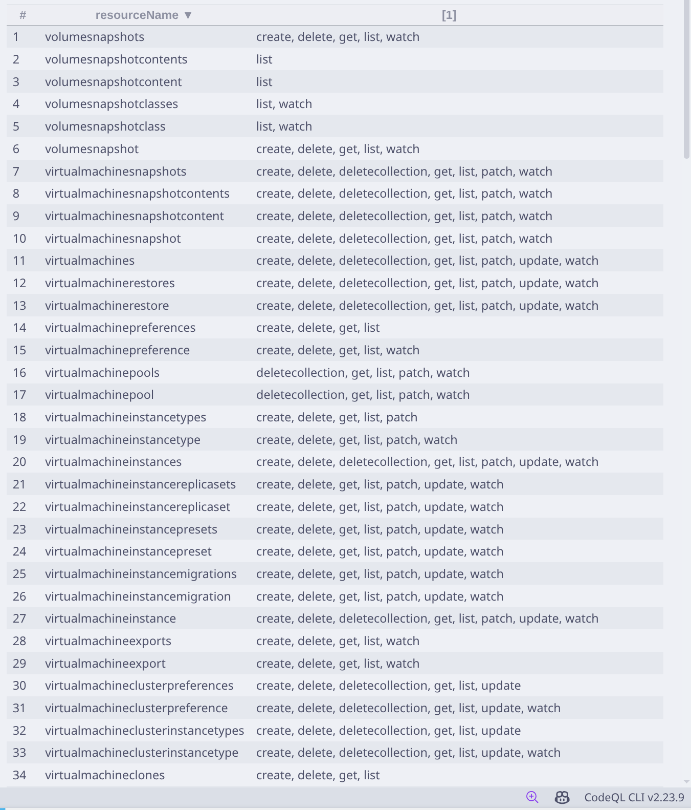

# RBACray (RBAC-xray)

RBACray is designed to scan API resource usage in cloud-native applications, primarily third-party Kubernetes applications, in order to derive the minimal set of permissions required by these applications.

This project is based on [EPScan](https://github.com/seclab-fudan/EPScan). Compared to the original work, RBACray removes code reachability analysis and extends the detection scope from Kubernetes built-in resources (such as Pods and Deployments) to custom resources defined by cloud-native applications.

Example screenshot (test on Kubevirt):

Although there are currently no known (or I dont know) real-world vulnerabilities caused by over-privileged access to custom resources, we believe this remains an important and underexplored security issue worthy of further attention.
